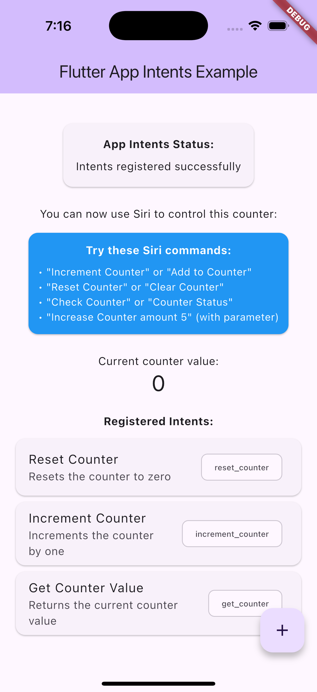
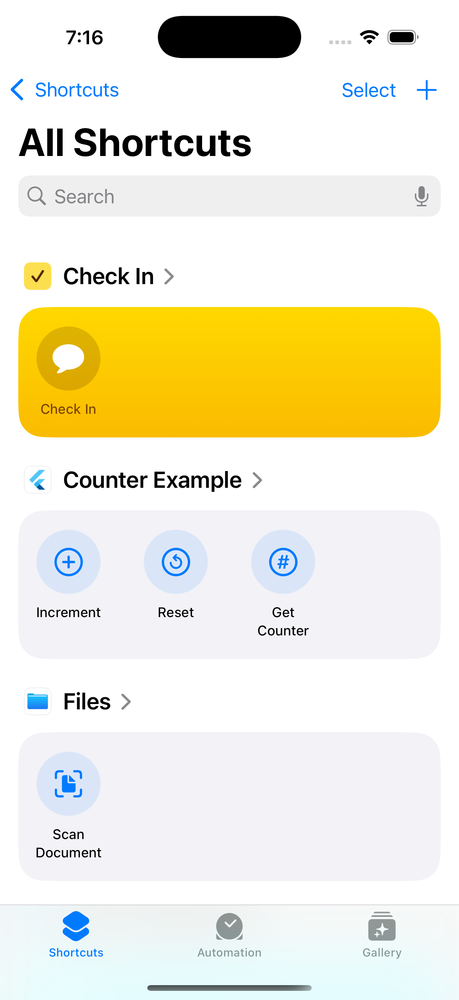

# Counter App Intents Example

This example demonstrates **action-based App Intents** using a simple counter application. It shows how to execute specific app functions through Siri voice commands (iOS) and Google Assistant (Android).

## Features Demonstrated

### Intent Types

This example demonstrates both **action** and **query** intents:

**Action Intents** (silent - just open the app):
- **Increment Counter**: Add to the counter value (with optional amount parameter)
- **Reset Counter**: Set counter back to zero

**Query Intents** (show result in dialog):
- **Get Counter**: Query current counter value and display it

### Key Concepts
- Parameter handling with type safety
- Intent donation for Siri learning
- Error handling and validation
- Action-based voice commands

## Architecture

This example uses the **hybrid approach** with:

1. **Static Swift App Intents** (`ios/Runner/AppDelegate.swift`)
2. **Flutter handlers** (`lib/main.dart`) 
3. **Bridge communication** via the plugin

## Screenshots

| App Interface | iOS Shortcuts |
|---------------|---------------|
|  |  |
| Counter app | iOS Shortcuts app |

## Quick Start

### Prerequisites

**iOS:**
- iOS 16.0+ device or simulator
- Flutter 3.8.1+
- Xcode 14.0+

**Android:**
- Android 7.1+ (API 25+) device or emulator
- Flutter 3.8.1+
- Android Studio or VS Code

### Run the Example

```bash
cd counter
flutter pub get

# For iOS
flutter run

# For Android
flutter run -d <android-device-id>
```

### Test on iOS

1. **Manual Testing**: Use the floating action button to increment the counter

2. **iOS Shortcuts**: Check the Shortcuts app for available actions

3. **Enable Siri**: ⚠️ **IMPORTANT** - In Shortcuts app, tap "Counter Example Shortcuts" and toggle ON the Siri switch (it's OFF by default)

4. **Siri Commands**:
   - "Increment counter with Counter Example"
   - "Reset counter with Counter Example"
   - "Get counter from Counter Example"

5. **Settings**: Go to Settings > Siri & Search > App Shortcuts

### Test on Android

#### Prerequisites for Android Testing
- Android device or emulator running Android 7.1+ (API 25+)
- Google app installed and updated
- Google Assistant enabled

#### Build for Android

```bash
# Debug build
flutter build apk --debug

# Release build (for testing with Google Assistant)
flutter build apk --release

# Install on device
flutter install
```

#### Testing App Actions

**Method 1: Using Google Assistant Test Tool**

1. **Install the App**:
   ```bash
   flutter install
   ```

2. **Open Google Assistant Test Tool**:
   ```bash
   adb shell am start -a android.intent.action.VIEW -d "https://assistant.google.com/services/a/uid/000000000000000000000"
   ```

3. **Test Commands**:
   - "Increment counter with Counter Example"
   - "Reset counter with Counter Example"
   - "Get counter from Counter Example"

**Method 2: Using ADB to Trigger Intents**

```bash
# Test increment counter
adb shell am start -a android.intent.action.VIEW -d "app://intent/increment_counter"

# Test reset counter
adb shell am start -a android.intent.action.VIEW -d "app://intent/reset_counter"

# Test get counter value
adb shell am start -a android.intent.action.VIEW -d "app://intent/get_counter"
```

**⚠️ Platform Difference: Query Intents**

The "Get Counter" intent (`get_counter`) demonstrates a platform difference:

- **iOS**: Shows result in a Siri dialog (e.g., "Current counter value is 5")
- **Android**: Opens the app silently, but doesn't display the result

**Why?** Android App Actions don't support inline result display yet. The intent handler runs successfully and returns the counter value, but Android just opens/focuses the app instead of showing a dialog. Widget-based result display is planned for a future release.

To verify `get_counter` works on Android, check the logs:
```bash
adb logcat | grep "Counter"
# Should show: [Counter] _handleGetCounterIntent called, counter value: X
```

**Method 3: Using Google Assistant (Requires Release Build)**

1. Build and install release APK:
   ```bash
   flutter build apk --release
   flutter install
   ```

2. Enable Google Assistant:
   - Long-press the home button or say "Hey Google"

3. Say commands like:
   - "Increment counter with Counter Example"
   - "Get my counter from Counter Example"

#### Verify Generated Android Files

After running the code generator, check these files were created:

```bash
# Shortcuts XML (defines App Actions)
android/app/src/main/res/xml/shortcuts.xml

# Widget files (for intents with presentsResult=true)
android/app/src/main/res/layout/widget_*.xml
android/app/src/main/res/xml/*_widget_info.xml
android/app/src/main/res/values/strings.xml  # Widget string resources
```

#### Android-Specific Requirements

1. **Minimum SDK**: The example requires API 25+ (Android 7.1+)
   - Set in `android/app/build.gradle.kts`: `minSdk = 25`

2. **String Resources**: For widget support, `strings.xml` is **auto-generated** by the code generator:
   - Located at: `android/app/src/main/res/values/strings.xml`
   - Contains widget descriptions and loading messages
   - You can customize these strings after generation for localization
   - Re-running the generator will update widget strings while preserving your custom app strings

3. **Deep Link Configuration**: Already configured in `AndroidManifest.xml`:
   ```xml
   <intent-filter>
       <action android:name="android.intent.action.VIEW"/>
       <category android:name="android.intent.category.DEFAULT"/>
       <category android:name="android.intent.category.BROWSABLE"/>
       <data android:scheme="app" android:host="intent"/>
   </intent-filter>
   ```

#### Troubleshooting Android

**Issue**: "Namespace not specified" error

**Solution**: The plugin's `android/build.gradle` has been updated with:
```gradle
android {
    namespace 'com.flutter_app_intents'
    // ...
}
```

**Issue**: "minSdkVersion cannot be smaller than version 25"

**Solution**: Update `android/app/build.gradle.kts`:
```kotlin
defaultConfig {
    minSdk = 25  // Required for App Actions
    // ...
}
```

**Issue**: App Actions not appearing in Google Assistant

**Solution**:
1. Ensure you're using a **release build** (`flutter build apk --release`)
2. Install the APK: `flutter install`
3. Clear Google app cache: Settings > Apps > Google > Storage > Clear Cache
4. Wait a few minutes for Google to index the app

**Issue**: String resource not found

**Solution**: Run the code generator to create `strings.xml`:
```bash
dart run flutter_app_intents:app_intents_cli --platform=android
```
The generator will automatically create widget string resources for intents with `presentsResult: true`

## Code Generation

**✨ NEW**: This example uses the code generator to automatically create platform-specific code from Dart definitions:
- **iOS**: Swift AppIntent structs and AppShortcutsProvider
- **Android**: shortcuts.xml and widget layouts (experimental)

### How It Works

1. **Dart Intent Definitions** (`lib/main.dart`):
```dart
// Action intent - opens app silently
final incrementIntent = AppIntentBuilder()
    .identifier('increment_counter')
    .title('Increment Counter')
    .description('Increments the counter by one')
    .category(IntentCategory.general)
    .build();  // presentsResult defaults to false

// Query intent - shows result in dialog
final getCounterIntent = AppIntentBuilder()
    .identifier('get_counter')
    .title('Get Counter Value')
    .description('Returns the current counter value')
    .category(IntentCategory.general)
    .presentsResult(true)  // ← Shows result to user
    .build();
```

2. **Generate Platform Code**:
```bash
# Auto-detect and generate for all available platforms
dart run flutter_app_intents:app_intents_cli

# Or specify platform explicitly
dart run flutter_app_intents:app_intents_cli --platform=ios
dart run flutter_app_intents:app_intents_cli --platform=android
```

3. **Generated Output**:

**iOS** (`ios/Runner/AppShortcuts.swift`):
- Swift AppIntent structs for each intent
- AppShortcutsProvider with Siri phrases
- Automatic bridging to Flutter handlers

**Android**:
- `shortcuts.xml`: Built-in Intent (BII) capability definitions
- `strings.xml`: Widget string resources (auto-generated for intents with `presentsResult=true`)
- Widget layouts and info files (experimental)

4. **Platform-Specific Setup**:

**iOS (one-time step)**:
   - Open `ios/Runner.xcworkspace` in Xcode
   - Right-click "Runner" folder → "Add Files to Runner..."
   - Select `ios/Runner/AppShortcuts.swift`
   - Check "Copy items if needed" and "Runner" target
   - Click "Add"

**Android**: No additional setup needed - generated XML files are automatically included in the build.

**Note**: iOS setup is only needed once. Regenerating files later will update them automatically.

### Regenerate After Changes

If you modify the intent definitions in Dart, regenerate the platform code:

```bash
# Auto-detect and generate for all platforms
dart run flutter_app_intents:app_intents_cli

# Generate for specific platform
dart run flutter_app_intents:app_intents_cli --platform=ios
dart run flutter_app_intents:app_intents_cli --platform=android

# Watch mode (regenerate on file changes)
dart run flutter_app_intents:app_intents_cli --watch
```

**Then restart your app:**
- **iOS**: Hot restart (press `R` in Flutter terminal)
- **Android**: Hot restart (press `R` in Flutter terminal) or reinstall

> **⚠️ Why Hot Restart, Not Hot Reload?**
>
> - **Hot reload** (`r`) only updates Dart code - it's fast but limited to Flutter framework
> - **Hot restart** (`R`) restarts the entire app including native platform code
>
> Generated files are **native platform code** (Swift for iOS, XML for Android), not Dart. The platform loads these files when the app starts, so changes require a full app restart.
>
> **What happens if you only hot reload:**
> - ❌ **iOS**: Siri won't see updated intents, phrases won't update
> - ❌ **Android**: Google Assistant won't recognize new App Actions
> - ❌ New intents won't appear in Shortcuts/Assistant
> - ✅ Only a hot restart will reload the native platform code
>
> **Remember:** Press `R` (capital R) after regenerating!

## Implementation Details

### Platform-Specific Generated Code

#### iOS: Swift AppIntents

The code generator creates static intents in `ios/Runner/AppShortcuts.swift`:

```swift
struct CounterIntent: AppIntent {
    static var title: LocalizedStringResource = "Increment Counter"
    static var description = IntentDescription("Increment the counter by one")
    static var isDiscoverable = true
    
    func perform() async throws -> some IntentResult & ReturnsValue<String> {
        let plugin = FlutterAppIntentsPlugin.shared
        let result = await plugin.handleIntentInvocation(
            identifier: "increment_counter",
            parameters: [:]
        )
        
        if let success = result["success"] as? Bool, success {
            let value = result["value"] as? String ?? "Counter incremented"
            return .result(value: value)
        } else {
            let errorMessage = result["error"] as? String ?? "Failed to increment counter"
            throw AppIntentError.executionFailed(errorMessage)
        }
    }
}
```

### Flutter Handlers  

The Flutter side handles the business logic:

```dart
Future<AppIntentResult> _handleIncrementIntent(Map<String, dynamic> parameters) async {
  final amount = parameters['amount'] as int? ?? 1;
  
  setState(() => _counter += amount);
  
  // Donate intent for Siri learning
  await _client.donateIntent('increment_counter', parameters);
  
  return AppIntentResult.successful(
    value: 'Counter incremented by $amount. New value: $_counter',
  );
}
```

#### iOS: App Shortcuts Provider

The static shortcuts are declared with an `AppShortcutsProvider`:

```swift
struct CounterAppShortcuts: AppShortcutsProvider {
    static var appShortcuts: [AppShortcut] {
        AppShortcut(
            intent: CounterIntent(),
            phrases: [
                "Increment counter with \(.applicationName)",
                "Add one with \(.applicationName)",
                "Count up using \(.applicationName)"
            ],
            shortTitle: "Increment",
            systemImageName: "plus.circle"
        )
        // ... other shortcuts
    }
}
```

#### Android: Shortcuts XML

The code generator creates App Actions in `android/app/src/main/res/xml/shortcuts.xml`:

```xml
<?xml version="1.0" encoding="utf-8"?>
<shortcuts xmlns:android="http://schemas.android.com/apk/res/android">
  <!-- Increment Counter Action -->
  <capability android:name="actions.intent.INCREMENT">
    <intent
      android:targetPackage="com.example.counter_example"
      android:targetClass="MainActivity"
      android:action="android.intent.action.VIEW"
      android:data="app://intent/increment_counter">
      <!-- Parameters defined here -->
    </intent>
  </capability>

  <!-- Get Counter Query -->
  <capability android:name="actions.intent.GET_THING">
    <intent
      android:targetPackage="com.example.counter_example"
      android:targetClass="MainActivity"
      android:action="android.intent.action.VIEW"
      android:data="app://intent/get_counter">
    </intent>
  </capability>
</shortcuts>
```

**Key components:**
- **`<capability>`**: Maps intents to Google Assistant Built-in Intents (BII)
- **`android:data`**: Deep link URI format (`app://intent/<identifier>`)
- **`<parameter>`**: Defines intent parameters with types and requirements
- **BII categories**: Automatically selected based on `IntentCategory` in Dart

## What You'll Learn

- ✅ How to create cross-platform App Intents
- ✅ Parameter handling and type safety
- ✅ **iOS**: Static intent declarations and AppShortcutsProvider
- ✅ **Android**: shortcuts.xml and Built-in Intents (BII)
- ✅ Platform-specific code generation from Dart
- ✅ Flutter-native bridge communication (both platforms)
- ✅ Intent donation for Siri/Assistant learning
- ✅ Error handling between platforms and Flutter
- ✅ Testing with Siri (iOS) and Google Assistant (Android)

## Next Steps

Check out the [navigation example](../navigation/) to see how App Intents can handle app navigation and deep linking.