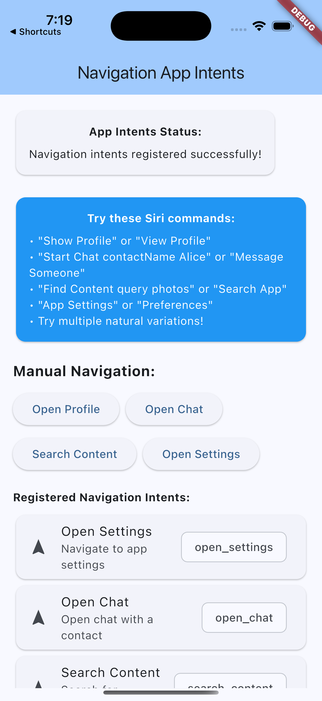
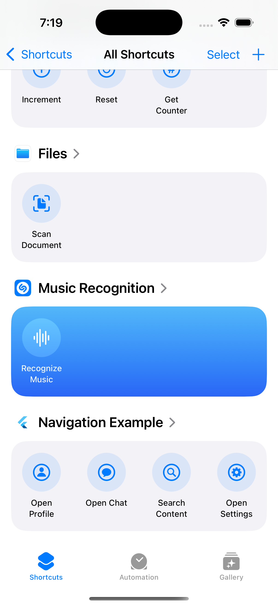

# Navigation App Intents Example

This example demonstrates **navigation-based App Intents** using a Flutter application with multiple pages. It shows how to perform deep linking and app navigation through Siri voice commands and iOS shortcuts.

## Features Demonstrated

### Navigation Intents
- **Open Profile**: Navigate to user profile page (with optional user ID parameter)
- **Open Chat**: Open chat page with specific contact
- **Search Content**: Navigate to search page with query
- **Open Settings**: Navigate to app settings

### Key Concepts
- Deep linking with route parameters
- Navigation intent handling with `needsToContinueInApp: true`
- Parameter passing between iOS and Flutter
- Intent donation for Siri learning
- Multiple page navigation architecture

## Architecture

This example uses the **hybrid approach** with:

1. **Static Swift App Intents** (`ios/Runner/AppDelegate.swift`)
2. **Flutter handlers** (`lib/main.dart`) 
3. **Bridge communication** via the plugin
4. **Flutter navigation** using named routes

## Screenshots

### App Interface
*Screenshot showing the home page with navigation buttons for Profile, Chat, Search, and Settings*

### Navigation Pages
*Screenshots showing the different pages: Profile page, Chat page, Search page, and Settings page*

### Siri Navigation
*Screenshot of Siri responding to "Open my profile in navigation example"*

### iOS Shortcuts for Navigation  
*Screenshot of the Shortcuts app showing available navigation shortcuts*

### Deep Linking in Action
*Screenshot showing a page opened via voice command with parameters (e.g., "Chat with Alice")*

## Screenshots

| App Interface | iOS Shortcuts |
|---------------|---------------|
|  |  |
| Navigation app | iOS Shortcuts app |

## Quick Start

### Prerequisites
- iOS 16.0+ device or simulator
- Flutter 3.8.1+
- Xcode 14.0+

### Run the Example

```bash
cd navigation
flutter pub get
flutter run
```

### Test the App Intents

1. **Manual Testing**: Use the buttons on the home page

2. **Siri Commands**:
   - "Open my profile in navigation example"
   - "Chat with Alice using navigation example"
   - "Search for photos in navigation example"
   - "Open settings with navigation example"

3. **iOS Shortcuts**: Check the Shortcuts app for available navigation actions

4. **Settings**: Go to Settings > Siri & Search > App Shortcuts

## Implementation Details

### Static Swift Intents

The iOS side defines static navigation intents in `AppDelegate.swift`:

```swift
struct OpenProfileIntent: AppIntent {
    static var title: LocalizedStringResource = "Open Profile"
    
    @Parameter(title: "User ID")
    var userId: String?
    
    func perform() async throws -> some IntentResult & OpensIntent {
        // Bridge to Flutter handler with navigation
        let result = await plugin.handleIntentInvocation(
            identifier: "open_profile", 
            parameters: ["userId": userId ?? "current"]
        )
        return .result(opensIntent: true)
    }
}
```

### Flutter Navigation Handlers  

The Flutter side handles navigation and route parameters:

```dart
Future<AppIntentResult> _handleOpenProfileIntent(Map<String, dynamic> parameters) async {
  final userId = parameters['userId'] as String? ?? 'current';
  
  if (mounted) {
    Navigator.of(context).pushNamed('/profile', arguments: {'userId': userId});
  }
  
  await _client.donateIntent('open_profile', parameters);
  
  return AppIntentResult.successful(
    value: 'Opening profile for user $userId',
    needsToContinueInApp: true, // Critical for navigation intents
  );
}
```

### Route Configuration

Named routes are configured in `MaterialApp`:

```dart
MaterialApp(
  routes: {
    '/profile': (context) {
      final args = ModalRoute.of(context)?.settings.arguments as Map<String, dynamic>?;
      return ProfilePage(userId: args?['userId'] ?? 'current');
    },
    '/chat': (context) {
      final args = ModalRoute.of(context)?.settings.arguments as Map<String, dynamic>?;
      return ChatPage(contactName: args?['contactName'] ?? 'Unknown');
    },
    // ... more routes
  },
)
```

## What You'll Learn

- ✅ How to create navigation-based App Intents
- ✅ Deep linking with route parameters  
- ✅ Using `OpensIntent` return type for navigation
- ✅ Setting `needsToContinueInApp: true` for proper app opening
- ✅ Parameter passing from Siri/Shortcuts to Flutter pages
- ✅ Named route configuration with dynamic arguments
- ✅ Intent donation for navigation learning
- ✅ Testing navigation with Siri and Shortcuts app

## Navigation vs Action Intents

This example focuses on **navigation intents** that:
- Open the app and navigate to specific pages
- Use `OpensIntent` return type in Swift
- Set `needsToContinueInApp: true` in Flutter
- Pass parameters to determine navigation destination

For **action intents** that perform operations without navigation, see the [counter example](../counter/).

## Next Steps

- Combine both navigation and action intents in your app
- Add more complex navigation patterns (nested routes, tabs)
- Implement custom entities for more sophisticated parameter types
- Add authentication/authorization checks before navigation
