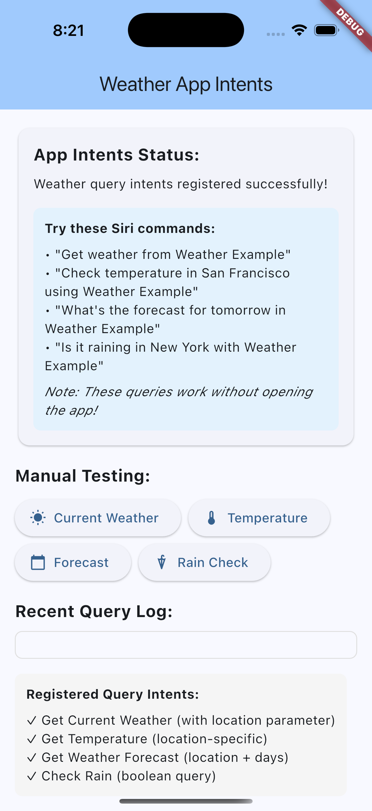
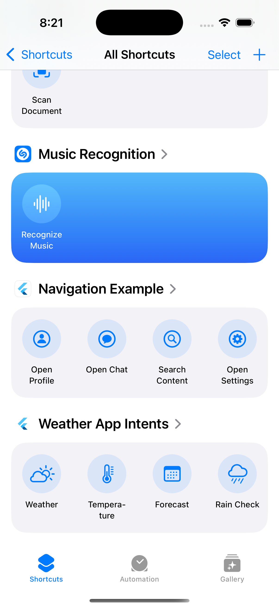

# Weather App Intents Example

This example demonstrates **query-based App Intents** using a weather application that provides information without opening the app interface. It showcases how to create background data queries with voice responses optimized for Siri.

## Features Demonstrated

### Query Intents with Voice Responses
- **Get Current Weather**: Comprehensive weather information with voice output
- **Get Temperature**: Specific temperature queries for quick answers
- **Get Weather Forecast**: Multi-day forecasts with parameter handling
- **Check Rain**: Boolean queries with yes/no voice responses

### Key Concepts
- Background data processing without opening the app
- `ProvidesDialog` for Siri voice responses
- Multiple parameter types (string, integer, optional parameters)
- Proper voice output formatting for natural speech
- Intent donation for Siri learning
- Query optimization for background operation

## Architecture

This example uses the **hybrid approach** with:

1. **Static Swift App Intents** (`ios/Runner/AppDelegate.swift`)
2. **Flutter handlers** (`lib/main.dart`) 
3. **Bridge communication** via the plugin
4. **Background operation** without UI requirements

## Screenshots

| App Interface | iOS Shortcuts |
|---------------|---------------|
|  |  |

## Quick Start

## Screenshots

| App Interface | iOS Shortcuts |
|---------------|---------------|
|  |  |
| Navigation app | iOS Shortcuts app |

### Prerequisites
- iOS 16.0+ device or simulator
- Flutter 3.8.1+
- Xcode 14.0+

### Run the Example

```bash
cd weather
flutter pub get
flutter run
```

### Test the App Intents

1. **Manual Testing**: Use the buttons in the app interface to test queries

2. **iOS Shortcuts**: Check the Shortcuts app for available weather actions

3. **Enable Siri**: ⚠️ **IMPORTANT** - In Shortcuts app, tap "Weather Example Shortcuts" and toggle ON the Siri switch (it's OFF by default)

4. **Siri Commands**:
   - "Get weather from Weather Example"
   - "Check temperature in San Francisco using Weather Example"
   - "What's the forecast for tomorrow in Weather Example"
   - "Is it raining in New York with Weather Example"

5. **Settings**: Go to Settings > Siri & Search > App Shortcuts

## Implementation Details

### Static Swift Intents

The iOS side defines static query intents in `AppDelegate.swift`:

```swift
@available(iOS 16.0, *)
struct GetCurrentWeatherIntent: AppIntent {
    static var title: LocalizedStringResource = "Get Current Weather"
    static var description = IntentDescription("Get current weather conditions for a location")
    static var isDiscoverable = true
    // Note: No openAppWhenRun - this works in background
    
    @Parameter(title: "Location")
    var location: String?
    
    func perform() async throws -> some IntentResult & ReturnsValue<String> & ProvidesDialog {
        let plugin = FlutterAppIntentsPlugin.shared
        let result = await plugin.handleIntentInvocation(
            identifier: "get_current_weather",
            parameters: ["location": location ?? "current location"]
        )
        
        if let success = result["success"] as? Bool, success {
            let value = result["value"] as? String ?? "Weather information retrieved"
            return .result(
                value: value,
                dialog: IntentDialog(stringLiteral: value)  // Ensures Siri speaks result
            )
        } else {
            let errorMessage = result["error"] as? String ?? "Failed to get weather"
            throw AppIntentError.executionFailed(errorMessage)
        }
    }
}
```

### Flutter Query Handlers  

The Flutter side handles data fetching and voice response formatting:

```dart
Future<AppIntentResult> _handleCurrentWeather(Map<String, dynamic> parameters) async {
  try {
    final location = parameters['location'] as String? ?? 'current location';
    
    // Simulate weather data fetching
    final weatherData = await _fetchWeatherData(location);
    
    // Log the query for demonstration
    setState(() {
      _queryLog.insert(0, 'Current weather for $location');
    });

    // Donate intent for Siri learning
    await _client.donateIntent('get_current_weather', parameters);

    // Format response optimized for Siri voice output
    final response = _formatCurrentWeatherResponse(weatherData, location);
    
    return AppIntentResult.successful(
      value: response,
      // Note: needsToContinueInApp = false for background queries
      needsToContinueInApp: false,
    );
  } catch (e) {
    return AppIntentResult.failed(
      error: 'Failed to get weather data: $e',
    );
  }
}
```

### Voice Response Formatting

Responses are optimized for Siri speech:

```dart
String _formatCurrentWeatherResponse(Map<String, dynamic> data, String location) {
  final temp = data['temperature'];
  final condition = data['condition'];
  final humidity = data['humidity'];
  final wind = data['wind_speed'];
  
  return 'Current weather in $location: $temp degrees and $condition. '
         'Humidity is $humidity percent with winds at $wind miles per hour.';
}
```

### App Shortcuts Provider

The static shortcuts are declared with an `AppShortcutsProvider`:

```swift
@available(iOS 16.0, *)
struct WeatherAppShortcuts: AppShortcutsProvider {
    static var appShortcuts: [AppShortcut] {
        // Current weather shortcut - comprehensive weather information
        AppShortcut(
            intent: GetCurrentWeatherIntent(),
            phrases: [
                "Get weather from \(.applicationName)",
                "Check weather using \(.applicationName)",
                "What's the weather in \(.applicationName)",
                "Current weather with \(.applicationName)"
            ],
            shortTitle: "Weather",
            systemImageName: "cloud.sun"
        )
        // ... other shortcuts
    }
}
```

## Query vs Action/Navigation Intents

This example focuses on **query intents** that:
- Work without opening the app (`needsToContinueInApp: false`)
- Use `ProvidesDialog` return type in Swift for voice responses
- Process data in the background and return formatted speech
- Optimize for quick information retrieval scenarios

**Key Differences from Other Examples:**
- **Counter Example**: Action-based intents that modify app state
- **Navigation Example**: Navigation intents that open specific app pages
- **Weather Example**: Query intents that provide information via voice

## What You'll Learn

- ✅ How to create query-based App Intents for background operation
- ✅ `ProvidesDialog` usage for Siri voice responses
- ✅ Multiple parameter handling (optional, required, different types)
- ✅ Voice response formatting for natural speech
- ✅ Background data processing without UI interaction
- ✅ Intent donation for query-based learning
- ✅ Testing query intents with Siri and Shortcuts app
- ✅ Optimizing for information retrieval use cases

## Voice Command Examples

### Basic Weather Queries
```
"Get weather from Weather Example"
"Check weather using Weather Example"
"What's the weather in Weather Example"
```

### Location-Specific Queries
```
"Get temperature in San Francisco using Weather Example"
"Check weather in New York with Weather Example"
"What's the forecast in Seattle from Weather Example"
```

### Specific Information Queries
```
"Is it raining in Miami with Weather Example"
"Get forecast for tomorrow using Weather Example"
"Check temperature using Weather Example"
```

## Advanced Features

### Parameter Handling
- **Optional parameters** with default values
- **Multiple parameter types** (string, integer)
- **Parameter validation** and error handling

### Voice Optimization
- **Natural speech formatting** for Siri responses
- **Concise vs detailed** response patterns
- **Boolean query optimization** (yes/no answers)

### Background Operation
- **No app opening required** for most queries
- **Fast response times** with simulated API calls
- **Proper error handling** for network failures

## Next Steps

This weather example demonstrates the query pattern that's perfect for:
- **Data retrieval apps** (news, finance, sports)
- **Information services** (weather, traffic, status)
- **Quick lookup tools** (dictionary, calculator, converter)

For action-based intents, see the [counter example](../counter/).
For navigation intents, see the [navigation example](../navigation/).
